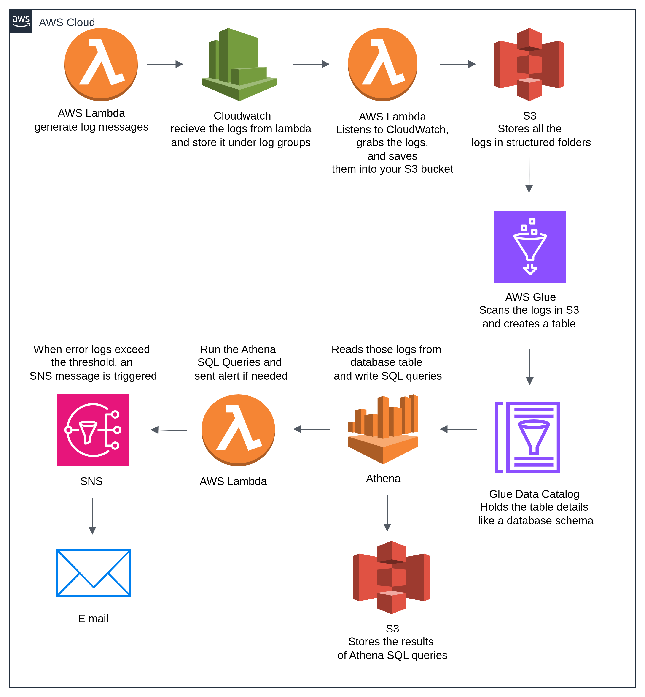

#  Log Analyzer using AWS Lambda, Athena & Glue

[](LICENSE)
[](https://github.com/Hridya2001/Serverless-log-analyzer-aws/commits/main)
[](https://github.com/Hridya2001/Serverless-log-analyzer-aws)


This project demonstrates a **serverless architecture** on AWS for monitoring and analyzing log events generated by Lambda functions. The solution is designed to **ingest, process, store, analyze, and alert** based on log data — entirely using AWS managed services.

---

## Overview

Serverless Log Analyzer is a real-time log processing pipeline built using AWS services like Lambda, CloudWatch, S3, Glue, Athena, and SNS. The system:

- Captures logs from AWS Lambda
- Ships them to S3 using a log-shipper Lambda function
- Structures and catalogs the logs using AWS Glue
- Queries logs using Athena to detect issues
- Sends alerts when errors exceed a threshold

---

## Project Structure

| Folder/File                      | Description                                                   |
|----------------------------------|---------------------------------------------------------------|
| `lambda/my-function.py`          | Lambda to generate log messages                               |
| `lambda/log-shipper.py`          | Lambda to decode & push logs to S3                            |
| `lambda/athena_alert_lambda.py`  | Lambda to run Athena query & trigger SNS alerts               |
| `athena/athena_queries.sql`      | SQL queries for log analysis in Athena                        |
| `diagram/image.png`              | Architecture diagram for the pipeline                         |
| `README.md`                      | Project documentation and setup guide                         |
| `.gitattributes`                 | GitHub language stats override config                         |
| `LICENSE`                        | MIT license for open-source use                               |

---

##  Architecture



---

##  Components & Responsibilities

| Component                     | Description |
|------------------------------|-------------|
| `Lambda (my-function)`       | Generates log messages (INFO, WARNING, ERROR) |
| `CloudWatch Logs`            | Stores logs from Lambda |
| `Lambda (log-shipper)`       | Subscribed to CloudWatch; parses and pushes logs to S3 |
| `S3: /logs/YYYY/MM/DD/`      | Stores structured logs for each day |
| `S3: /athena-results/`       | Stores the result of Athena SQL queries |
| `Glue Crawler`               | Scans logs in S3 and creates schema |
| `Glue Data Catalog`          | Stores table definitions for Athena |
| `Athena`                     | Executes SQL queries on logs |
| `Lambda (athena_alert_lambda)` | Periodically checks error counts and triggers alerts |
| `SNS`                        | Sends alerts via Email, SMS, or App Notification |

---

##  Features

-  Fully Serverless Architecture
-  Structured S3 log storage with timestamps
-  SQL-based log analytics using Athena
-  Real-time alerts via Amazon SNS
-  Auto-generated schema from JSON logs via Glue
-  Email alerts for operational issues

---

##  Setup Instructions

### 1.  Create Lambda Function: `my-function.py`

Generates dummy logs with different severity levels.

#### IAM Permissions

```json
{
  "Effect": "Allow",
  "Action": [
    "logs:CreateLogGroup",
    "logs:CreateLogStream",
    "logs:PutLogEvents"
  ],
  "Resource": "*"
}
```


### 2.  View Logs in CloudWatch

- Navigate to **CloudWatch** → **Logs**
- Select log group:  
  `/aws/lambda/my-function`


### 3. Create Lambda: `log-shipper.py`

Subscribed to `/aws/lambda/my-function` log group and writes logs to S3.

#### IAM Permissions

```json
{
  "Effect": "Allow",
  "Action": ["s3:PutObject"],
  "Resource": "arn:aws:s3:::log-analyzer-hridya/*"
}
```

Add **subscription filter** in CloudWatch → Target: `log-shipper`


### 4.  Create Primary S3 Bucket for Logs

- **Bucket Name**: `log-analyzer-hridya`
- **Purpose**: Stores logs in structured folders
- **Folder Structure**:
  ```
  /logs/YYYY/MM/DD/
  ```


### 5.  Set Up AWS Glue Crawler

- Source: `s3://log-analyzer-hridya/logs/`
- Output: Database `log_analysis_db`
- Creates a **Glue Data Catalog Table** (e.g., `logs_json`)
#### IAM Role

```json
{
  "Effect": "Allow",
  "Action": ["s3:GetObject", "glue:*"],
  "Resource": "*"
}
```


### 6.  Query Using Athena

To analyze your logs, open the **Amazon Athena Console**:

-  Go to the [Athena Console](https://console.aws.amazon.com/athena/)
-  In the **Query Editor**, do the following:
   - From the left panel, **choose your database**: `log_analysis_db`
   - Select the table created by Glue ( `logs_json`)
   - Write and run 
- You can find sample Athena queries [`here`](src/Athena.sql)

  
**Set the Query Result Location**  
Athena stores query outputs in an S3 location:

- Click the gear icon in the top-right corner of the Athena console
- Set the **query result location** to `s3://athena-results/` 


### 7. Create S3 Bucket for Athena Query Results

Create a **separate bucket** that will store Athena's query result files.

- **Bucket Name**: `athena-results`
- **Purpose**: Athena stores output of each SQL query here (CSV/JSON format)

**These results can be useful for:**
- Debugging
- Auditing historical log queries
- Triggering downstream processes (like alerts)

  


### 8.  Set Up SNS Alerts

- Create Topic: `log-alerts-topic`
- Subscribe: Email → Confirm in your inbox


### 9.  Lambda Alerting Function: `athena_alert_lambda.py`

Runs periodic Athena queries to count `ERROR` logs.

#### IAM Permissions

```json
{
  "Effect": "Allow",
  "Action": [
    "athena:*",
    "s3:GetObject",
    "s3:PutObject",
    "sns:Publish"
  ],
  "Resource": "*"
}
```

---


##  Conclusion

This project demonstrates a fully **serverless**, modular log analysis pipeline using AWS services such as Lambda, CloudWatch, S3, Glue, Athena, and SNS.

While the current setup captures logs based on manual invocation (e.g., using the Lambda test button), the architecture is designed to be easily extended into a fully automated, production-ready system. By integrating services like **Amazon EventBridge** or **API Gateway**, log generation and collection can become event-driven and continuous.

The core strengths of this architecture include its serverless nature, structured log storage in S3 with partitions, queryable schema via the Glue Data Catalog, and SQL-based log analysis using Amazon Athena. Real-time operational alerts are delivered using SNS, enhancing observability without the need to manage infrastructure.

This setup can be extended with enhancements such as scheduled log generation using EventBridge, visualizing log data using Amazon QuickSight, integrating alerts with external tools like Slack or PagerDuty, and aggregating logs from multiple Lambda functions or services. Overall, it offers a scalable foundation for building cost-effective and insightful monitoring solutions with minimal operational overhead.

------
